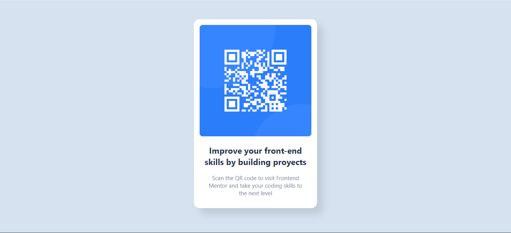

# QR code component solution

This is a solution to the [QR code component challenge on Frontend Mentor](https://www.frontendmentor.io/challenges/qr-code-component-iux_sIO_H). Frontend Mentor challenges help you improve your coding skills by building realistic projects. 

## Table of contents

- [Overview](#overview)
  - [Screenshot](#screenshot)
- [My process](#my-process)
  - [Built with](#built-with)
  - [What I learned](#what-i-learned)
  - [Continued development](#continued-development)
- [Author](#author)

## Overview
This is the first proyect that i did in this plataform, is a QR Code interfaces where i put all my effort for create it in based on my experience, i hope learn more of proyects like this one.

### Screenshot

## My process

This proyect was a good practice for enhance my skills in the code and make more stronger css and html "language", i did it using simples things with no mistic techniques at all, i help myself visiting the oficial documentation of html and css too.
### Built with

- Semantic HTML5 markup
- CSS custom properties
- Flexbox
- Mobile-first workflow

### What I learned

In this short proyect i've learned how to manage the space in the display, focusing in the responsive designed, something that i learned too is Mobile-first workflow, practice make me better and i'm happy for what i'm doing.

### Continued development

I would like to continue with my learning, focusing on the use of box design, flexbox, and grid, to create great designs based on these basic concepts. I aspire to become a skilled front-end developer, and this is my path.

## Author

- Linkdin - [Jordy Avila](https://www.linkedin.com/in/jordy-avila-706852251/)
- Frontend Mentor - [@Jordy01090](https://www.frontendmentor.io/profile/Jordy01090)

